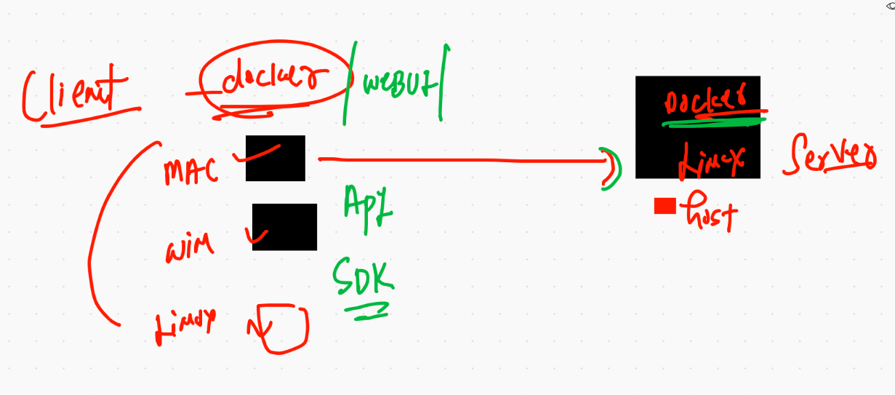
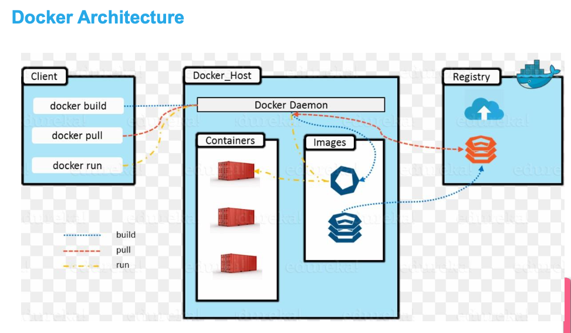
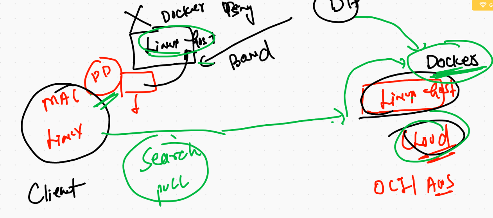
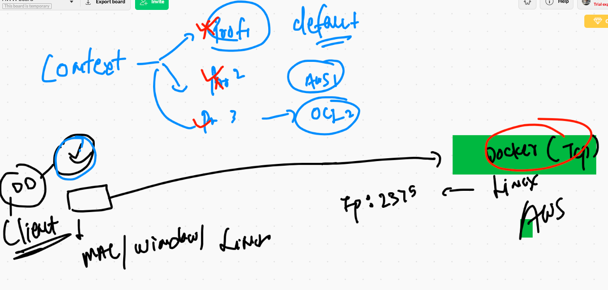
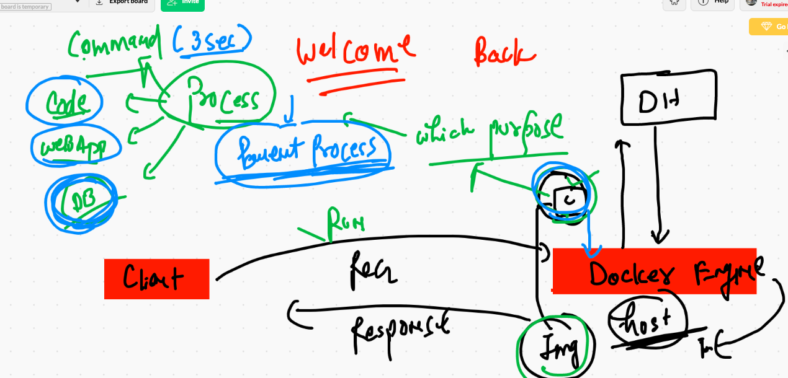

# DOCker & Kubernetes 

## ON prim & IN OCI 

## ALong with Micro services understanding 


## VM drawback  WRT. to application 


## OS -- kernel introduction 


## application model from Bare-metal -- Hypervisor -- COntainers


## COntainer run time engine options 


# Docker ce install on LInux vm 

```
[root@ip-172-31-69-94 ~]# yum   install docker  -y
Failed to set locale, defaulting to C
Loaded plugins: extras_suggestions, langpacks, priorities, update-motd
amzn2-core                                                                                          | 3.7 kB  00:00:00     
Resolving Dependencies
--> Running transaction check
---> Package docker.x86_64 0:19.03.13ce-1.amzn2 will be installed
--> Processing Dependency: runc >= 1.0.0 for package: docker-19.03.13ce-1.amzn2.x86_64
--> Processing Dependency: containerd >= 1.3.2 for package: docker-19.03.13ce-1.amzn2.x86_64
--> Processing Dependency: pigz for package: docker-19.03.13ce-1.amzn2.x86_64
--> Processing Dependency: libcgroup for package: docker-19.03.13ce-1.amzn2.x86_64
--> Running transaction check
---> Package containerd.x86_64 0:1.4.1-2.amzn2 will be installed
---> Package libcgroup.x86_64 0:0.41-21.amzn2 will be installed


```

## Note: INcase you don't have repo connected then follow that link 

[docker install on linux host](https://docs.docker.com/engine/install/centos/)


## starting docker 

```
[root@ip-172-31-69-94 ~]# systemctl  start  docker 
[root@ip-172-31-69-94 ~]# systemctl enable  docker 
Created symlink from /etc/systemd/system/multi-user.target.wants/docker.service to /usr/lib/systemd/system/docker.service.
[root@ip-172-31-69-94 ~]# systemctl status   docker 
● docker.service - Docker Application Container Engine
   Loaded: loaded (/usr/lib/systemd/system/docker.service; enabled; vendor preset: disabled)
   Active: active (running) since Mon 2021-02-15 06:51:14 UTC; 10s ago
     Docs: https://docs.docker.com
 Main PID: 4268 (dockerd)
   CGroup: /system.slice/docker.service
           └─4268 /usr/bin/dockerd -H fd:// --containerd=/run/containerd/containerd.sock --default-ulimit nofile=1024:40...

Feb 15 06:51:13 ip-172-31-69-94.ec2.internal dockerd[4268]: time="2021-02-15T06:51:13.485637146Z" level=info msg="sc...grpc
Feb 15 06:51:13 ip-172-31-69-94.ec2.internal dockerd[4268]: time="2021-02-15T06:51:13.485653077Z" level=info msg="cc...grpc
Feb 15 06:51:13 ip-172-31-69-94.ec2.internal dockerd[4268]: time="2021-02-15T06:51:13.485664527Z" level=info msg="Cl...grpc
Feb 15 06:51:13 ip-172-31-69-94.ec2.internal dockerd[4268]: time="2021-02-15T06:51:13.534524015Z" level=info msg="Lo...rt."
Feb 15 06:51:14 ip-172-31-69-94.ec2.internal dockerd[4268]: time="2021-02-15T06:51:14.029115478Z" level=info msg="De...ess"
Feb 15 06:51:14 ip-172-31-69-94.ec2.internal dockerd[4268]: time="2021-02-15T06:51:14.257311022Z" level=info msg="Lo...ne."
Feb 15 06:51:14 ip-172-31-69-94.ec2.internal dockerd[4268]: time="2021-02-15T06:51:14.294224354Z" level=info msg="Do...3-ce
Feb 15 06:51:14 ip-172-31-69-94.ec2.internal dockerd[4268]: time="2021-02-15T06:51:14.295647660Z" level=info msg="Da...ion"
Feb 15 06:51:14 ip-172-31-69-94.ec2.internal dockerd[4268]: time="2021-02-15T06:51:14.317657557Z" level=info msg="AP...ock"
Feb 15 06:51:14 ip-172-31-69-94.ec2.internal systemd[1]: Started Docker Application Container Engine.
Hint: Some lines were ellipsized, use -l to show in full.


```


## checking installation from client 

```
❯ docker  version
Client: Docker Engine - Community
 Cloud integration: 1.0.7
 Version:           20.10.2
 API version:       1.41
 Go version:        go1.13.15
 Git commit:        2291f61
 Built:             Mon Dec 28 16:12:42 2020
 OS/Arch:           darwin/amd64
 Context:           default
 Experimental:      true

Server: Docker Engine - Community
 Engine:
  Version:          20.10.2
  API version:      1.41 (minimum version 1.12)
  Go version:       go1.13.15
  Git commit:       8891c58
  Built:            Mon Dec 28 16:15:28 2020
  OS/Arch:          linux/amd64
  Experimental:     false
 containerd:
  Version:          1.4.3
  GitCommit:        269548fa27e0089a8b8278fc4fc781d7f65a939b
 runc:
  Version:          1.0.0-rc92
  GitCommit:        ff819c7e9184c13b7c2607fe6c30ae19403a7aff
 docker-init:
  Version:          0.19.0
  GitCommit:        de40ad0


```

## docker client 



## Simple docker architecture 



## Some docker. client request to docker engine (server)

```
 7500  docker  search   mysql 
 7501  docker  search   jdk
 7502  docker  search  java
 7503  docker  search  dockerashu
 7504  docker  search  ashutoshh

```


## Docker pull 

```
❯ docker  pull   java
Using default tag: latest
latest: Pulling from library/java
5040bd298390: Pull complete 
fce5728aad85: Pull complete 
76610ec20bf5: Pull complete 
60170fec2151: Pull complete 
e98f73de8f0d: Pull complete 
11f7af24ed9c: Pull complete 
49e2d6393f32: Pull complete 
bb9cdec9c7f3: Pull complete 
Digest: sha256:c1ff613e8ba25833d2e1940da0940c3824f03f802c449f3d1815a66b7f8c0e9d
Status: Downloaded newer image for java:latest
docker.io/library/java:latest
❯ docker  images
REPOSITORY   TAG       IMAGE ID       CREATED       SIZE
java         latest    d23bdf5b1b1b   4 years ago   643MB

```


## Docker client  to Remote docker engine connection 



## IN custom / private linux host - you can enable tcp in docker engine 

```
[ec2-user@ip-172-31-69-94 ~]$ sudo -i
[root@ip-172-31-69-94 ~]# cd  /etc/sysconfig/
[root@ip-172-31-69-94 sysconfig]# ls
acpid       clock     docker          init        modules          nfs            rpc-rquotad  run-parts  sysstat.ioconf
atd         console   docker-storage  irqbalance  netconsole       raid-check     rpcbind      selinux
authconfig  cpupower  grub            keyboard    network          rdisc          rsyncd       sshd
chronyd     crond     i18n            man-db      network-scripts  readonly-root  rsyslog      sysstat
[root@ip-172-31-69-94 sysconfig]# vim docker
[root@ip-172-31-69-94 sysconfig]# cat  docker
# The max number of open files for the daemon itself, and all
# running containers.  The default value of 1048576 mirrors the value
# used by the systemd service unit.
DAEMON_MAXFILES=1048576

# Additional startup options for the Docker daemon, for example:
# OPTIONS="--ip-forward=true --iptables=true"
# By default we limit the number of open files per container
OPTIONS="--default-ulimit nofile=1024:4096  -H tcp://0.0.0.0:2375"

# How many seconds the sysvinit script waits for the pidfile to appear
# when starting the daemon.
DAEMON_PIDFILE_TIMEOUT=10
[root@ip-172-31-69-94 sysconfig]# systemctl daemon-reload 
[root@ip-172-31-69-94 sysconfig]# systemctl restart docker 
[root@ip-172-31-69-94 sysconfig]# netstat -nlpt    |   grep -i docker
tcp6       0      0 :::2375                 :::*                    LISTEN      5904/dockerd 
```

## Docker client with context 



## checking context on client machine 

```
❯ docker  context   ls
NAME                TYPE                DESCRIPTION                               DOCKER ENDPOINT               KUBERNETES ENDPOINT   ORCHESTRATOR
default *           moby                Current DOCKER_HOST based configuration   unix:///var/run/docker.sock                         swarm

```


## First container process understanding 



## creation & checking of containers 

```
7542  docker  run  --name  ashuc1   busybox   cal  
 7543  docker  ps
 7544  docker  ps -a
 7545  docker  run    busybox  ping google.com  
 7546  docker  ps
 7547  docker  ps -a
 7548  history
 7549  docker  ps -a
❯ docker  run  --name ashuc2  -d  busybox  ping fb.com
81217e31fe90dad2eb6057ec276f6abce59edf350e45ff283ead143d5f9f2bdc
❯ docker  ps
CONTAINER ID   IMAGE     COMMAND             CREATED         STATUS         PORTS     NAMES
81217e31fe90   busybox   "ping fb.com"       9 seconds ago   Up 7 seconds             ashuc2
a18f5ff65fb9   busybox   "ping google.com"   2 minutes ago   Up 2 minutes             great_wescoff
6339ae857ef2   busybox   "ping google.com"   2 minutes ago   Up 2 minutes             charming_kalam

```


## checking output of containers parent process

```
 7553  docker  logs  ashuc2
 7554  docker  logs -f  ashuc2
❯ docker  ps

```

## more container operations 

```

❯ docker  stop   ashuc2
ashuc2


====

❯ docker  ps
CONTAINER ID   IMAGE     COMMAND             CREATED         STATUS         PORTS     NAMES
ea7446e5abd2   busybox   "ping fb.com"       5 minutes ago   Up 1 second              rajic2
81217e31fe90   busybox   "ping fb.com"       5 minutes ago   Up 3 seconds             ashuc2
a18f5ff65fb9   busybox   "ping google.com"   8 minutes ago   Up 8 minutes             great_wescoff
6339ae857ef2   busybox   "ping google.com"   8 minutes ago   Up 8 minutes             charming_kalam
❯ docker  ps  -q
ea7446e5abd2
81217e31fe90
a18f5ff65fb9
6339ae857ef2
❯ docker kill  $(docker  ps  -q)
ea7446e5abd2
81217e31fe90
a18f5ff65fb9
6339ae857ef2

```


## to start all possible containers 

```
 docker   start  $(docker  ps  -aq)
 
```

