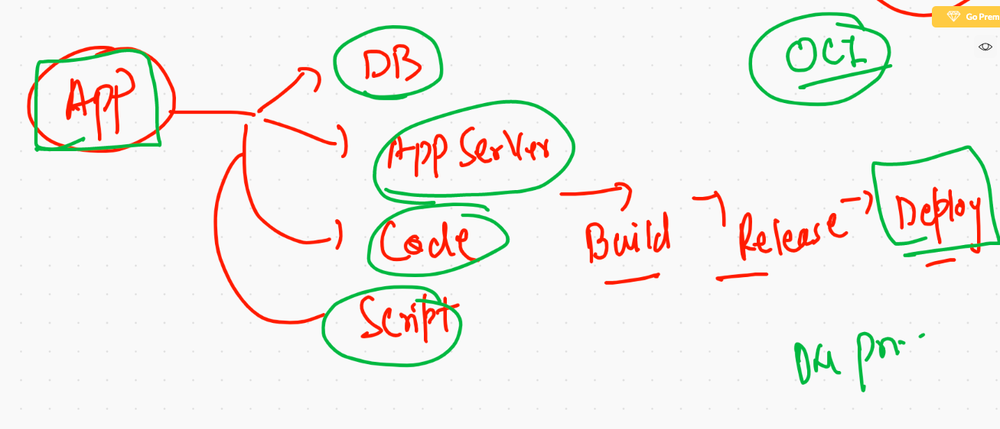
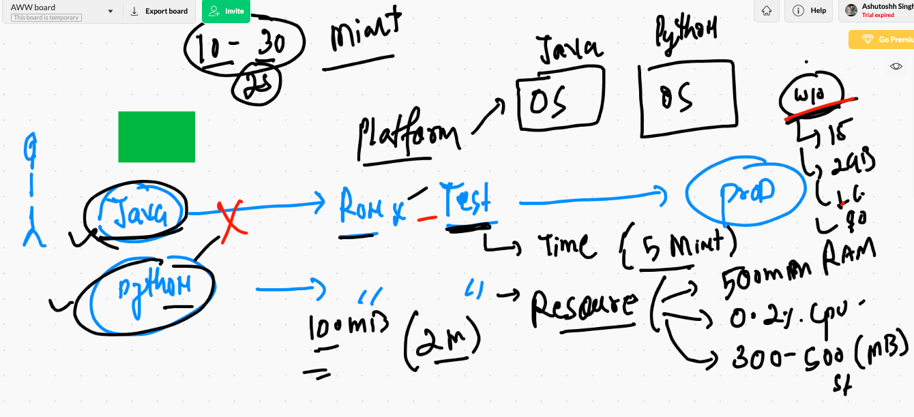
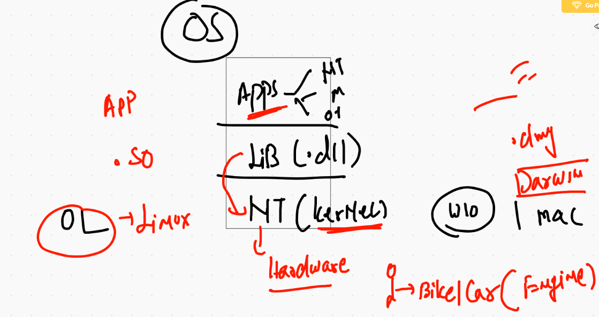
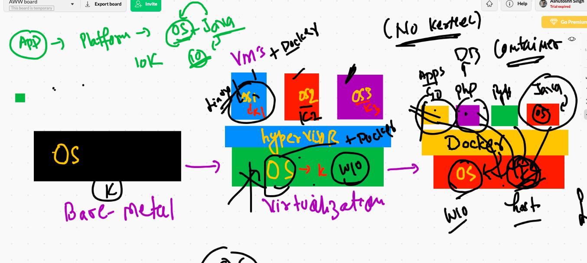
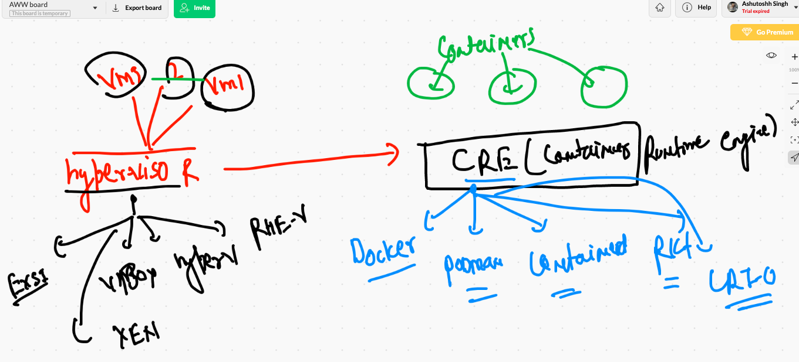

# DOCker & Kubernetes 

## ON prim & IN OCI 

## ALong with Micro services understanding 



## VM drawback  WRT. to application 



## OS -- kernel introduction 



## application model from Bare-metal -- Hypervisor -- COntainers



## COntainer run time engine options 




# Docker ce install on LInux vm 

```
[root@ip-172-31-69-94 ~]# yum   install docker  -y
Failed to set locale, defaulting to C
Loaded plugins: extras_suggestions, langpacks, priorities, update-motd
amzn2-core                                                                                          | 3.7 kB  00:00:00     
Resolving Dependencies
--> Running transaction check
---> Package docker.x86_64 0:19.03.13ce-1.amzn2 will be installed
--> Processing Dependency: runc >= 1.0.0 for package: docker-19.03.13ce-1.amzn2.x86_64
--> Processing Dependency: containerd >= 1.3.2 for package: docker-19.03.13ce-1.amzn2.x86_64
--> Processing Dependency: pigz for package: docker-19.03.13ce-1.amzn2.x86_64
--> Processing Dependency: libcgroup for package: docker-19.03.13ce-1.amzn2.x86_64
--> Running transaction check
---> Package containerd.x86_64 0:1.4.1-2.amzn2 will be installed
---> Package libcgroup.x86_64 0:0.41-21.amzn2 will be installed


```


## starting docker 

```
[root@ip-172-31-69-94 ~]# systemctl  start  docker 
[root@ip-172-31-69-94 ~]# systemctl enable  docker 
Created symlink from /etc/systemd/system/multi-user.target.wants/docker.service to /usr/lib/systemd/system/docker.service.
[root@ip-172-31-69-94 ~]# systemctl status   docker 
● docker.service - Docker Application Container Engine
   Loaded: loaded (/usr/lib/systemd/system/docker.service; enabled; vendor preset: disabled)
   Active: active (running) since Mon 2021-02-15 06:51:14 UTC; 10s ago
     Docs: https://docs.docker.com
 Main PID: 4268 (dockerd)
   CGroup: /system.slice/docker.service
           └─4268 /usr/bin/dockerd -H fd:// --containerd=/run/containerd/containerd.sock --default-ulimit nofile=1024:40...

Feb 15 06:51:13 ip-172-31-69-94.ec2.internal dockerd[4268]: time="2021-02-15T06:51:13.485637146Z" level=info msg="sc...grpc
Feb 15 06:51:13 ip-172-31-69-94.ec2.internal dockerd[4268]: time="2021-02-15T06:51:13.485653077Z" level=info msg="cc...grpc
Feb 15 06:51:13 ip-172-31-69-94.ec2.internal dockerd[4268]: time="2021-02-15T06:51:13.485664527Z" level=info msg="Cl...grpc
Feb 15 06:51:13 ip-172-31-69-94.ec2.internal dockerd[4268]: time="2021-02-15T06:51:13.534524015Z" level=info msg="Lo...rt."
Feb 15 06:51:14 ip-172-31-69-94.ec2.internal dockerd[4268]: time="2021-02-15T06:51:14.029115478Z" level=info msg="De...ess"
Feb 15 06:51:14 ip-172-31-69-94.ec2.internal dockerd[4268]: time="2021-02-15T06:51:14.257311022Z" level=info msg="Lo...ne."
Feb 15 06:51:14 ip-172-31-69-94.ec2.internal dockerd[4268]: time="2021-02-15T06:51:14.294224354Z" level=info msg="Do...3-ce
Feb 15 06:51:14 ip-172-31-69-94.ec2.internal dockerd[4268]: time="2021-02-15T06:51:14.295647660Z" level=info msg="Da...ion"
Feb 15 06:51:14 ip-172-31-69-94.ec2.internal dockerd[4268]: time="2021-02-15T06:51:14.317657557Z" level=info msg="AP...ock"
Feb 15 06:51:14 ip-172-31-69-94.ec2.internal systemd[1]: Started Docker Application Container Engine.
Hint: Some lines were ellipsized, use -l to show in full.


```


## checking installation from client 

```
❯ docker  version
Client: Docker Engine - Community
 Cloud integration: 1.0.7
 Version:           20.10.2
 API version:       1.41
 Go version:        go1.13.15
 Git commit:        2291f61
 Built:             Mon Dec 28 16:12:42 2020
 OS/Arch:           darwin/amd64
 Context:           default
 Experimental:      true

Server: Docker Engine - Community
 Engine:
  Version:          20.10.2
  API version:      1.41 (minimum version 1.12)
  Go version:       go1.13.15
  Git commit:       8891c58
  Built:            Mon Dec 28 16:15:28 2020
  OS/Arch:          linux/amd64
  Experimental:     false
 containerd:
  Version:          1.4.3
  GitCommit:        269548fa27e0089a8b8278fc4fc781d7f65a939b
 runc:
  Version:          1.0.0-rc92
  GitCommit:        ff819c7e9184c13b7c2607fe6c30ae19403a7aff
 docker-init:
  Version:          0.19.0
  GitCommit:        de40ad0


```


