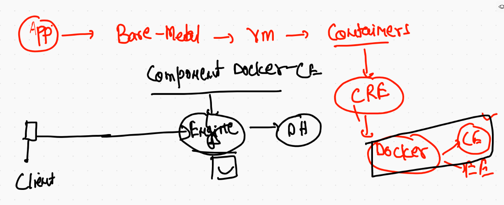
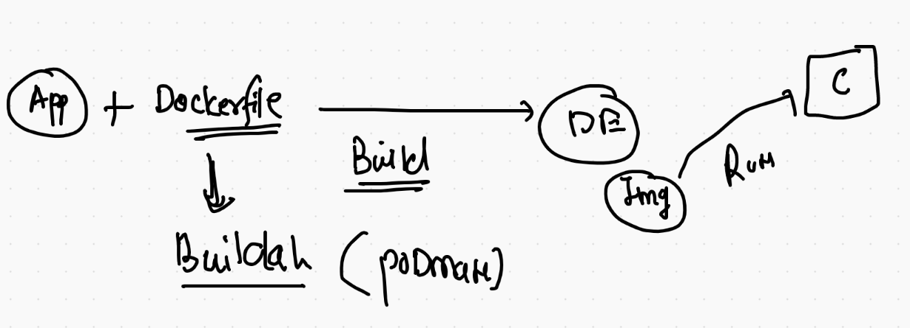
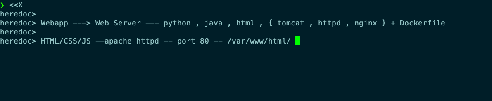
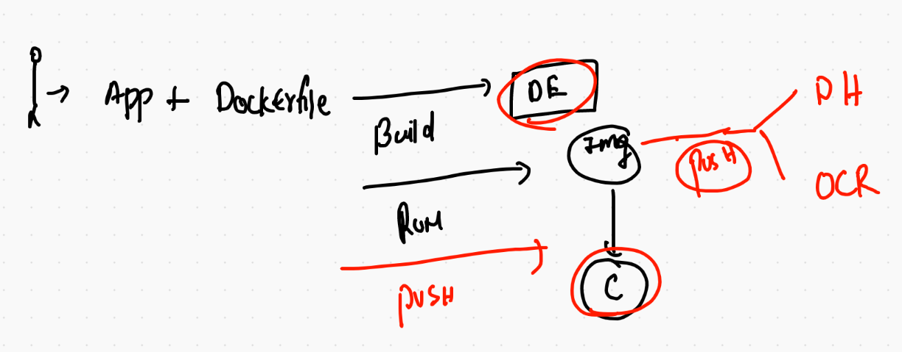
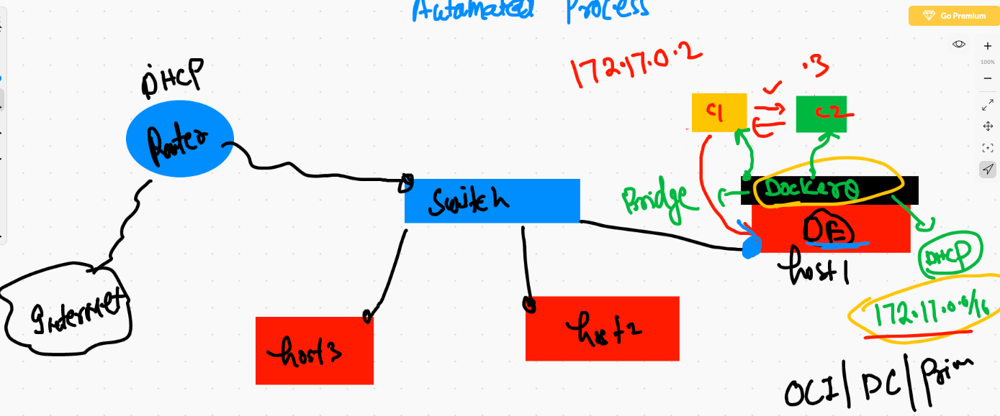
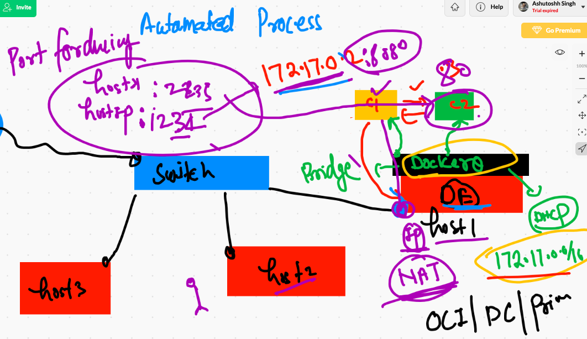

# Recap 



## Containerization 



## Docker image internal 

```
❯ docker  inspect hinapy:v1
[
    {
        "Id": "sha256:9634a93273d557b002e026f432a74a0e1c222c923a7da4107bf5cc4bbf3ce1c2",
        "RepoTags": [
            "hinapy:v1"
        ],
        "RepoDigests": [],
        "Parent": "sha256:002412df6155cfc21f32a3aead674d2b52711d7b44a602825fe68464e8de86d9",
        "Comment": "",
        "Created": "2021-02-15T11:39:16.365393768Z",
        "Container": "71d3e469a76441b1d7f6951bfc6330c86a6ca149820590a3ce86cd02cfe27e86",
        "ContainerConfig": {
            "Hostname": "71d3e469a764",
            "Domainname": "",


```

## checking image build history 

```
❯ docker  history  hinapy:v1
IMAGE          CREATED        CREATED BY                                      SIZE      COMMENT
9634a93273d5   17 hours ago   /bin/sh -c #(nop)  CMD ["python3" "while.py"]   0B        
002412df6155   17 hours ago   /bin/sh -c #(nop) WORKDIR /code                 0B        
6fed050aaedb   17 hours ago   /bin/sh -c #(nop) COPY file:d891934aeb1269c8…   60B       
20b71485e679   17 hours ago   /bin/sh -c mkdir /code                          0B        
658ca94e6148   17 hours ago   /bin/sh -c dnf clean all                        1.71MB    
ca1f64d885ee   17 hours ago   /bin/sh -c dnf install python3 -y               122MB     
a64bf62a6b6b   17 hours ago   /bin/sh -c #(nop)  MAINTAINER ashutoshh@linu…   0B        
d8ccb1b24024   10 days ago    /bin/sh -c #(nop)  CMD ["/bin/bash"]            0B        
<missing>      10 days ago    /bin/sh -c #(nop) ADD file:ac3abfcde004b7133…   223MB  

```

# Webapps to docker images

## html webapp using apache httpd with dockerfile



## HTtpd web server Dockerfile

```
FROM oraclelinux:8.3
MAINTAINER ashutoshh@linux.com
RUN dnf install httpd -y
# installing httpd web server free & OSS 
COPY . /var/www/html/
#  src  dest 
EXPOSE 80   
# to auto detect default port of httpd server 
# incase user don't wanna define (Optional)
CMD ["httpd","-DFOREGROUND"]
# starting httpd web server using this script command 
# systemd is not supported 

```

## .dockerignore content 

```
Dockerfile
.dockerignore
LICENSE
*.md
.git

```

## Image build process from different location 

```
docker build -t  ashuhttpd:febv1  ./Desktop/mycode/htmlwebapp 

```

## launching container

```
7715  docker  run -d --name ashucx1  -p  1122:80     ashuhttpd:febv1  
 7716  docker  ps
❯ docker  ps
CONTAINER ID   IMAGE               COMMAND                CREATED          STATUS          PORTS                  NAMES
f262143355c6   rajihttpd:v1        "httpd -DFOREGROUND"   9 seconds ago    Up 7 seconds    0.0.0.0:9999->80/tcp   rajihttpd_c1
c4549e66d436   vpasamhttpd:v1      "httpd -DFOREGROUND"   23 seconds ago   Up 21 seconds   0.0.0.0:1140->80/tcp   vpasamhttpd2
22f40d32f6b7   ashuhttpd:febv1     "httpd -DFOREGROUND"   49 seconds ago   Up 47 seconds   0.0.0.0:7001->80/tcp   samv1
2839d15823c3   anauhttpd:febv2     "httpd -DFOREGROUND"   2 minutes ago    Up 2 minutes    0.0.0.0:1234->80/tcp   anaucx1
3b0ecaa923ae   ashishhttpd:febv1   "httpd -DFOREGROUND"   2 minutes ago    Up 2 minutes    0.0.0.0:1133->80/tcp   ashishcx
19b9e183d180   naghttpd:v1         "httpd -DFOREGROUND"   2 minutes ago    Up 2 minutes    0.0.0.0:6011->80/tcp   nagweb
77f4b672ec2e   ashuhttpd:febv1     "httpd -DFOREGROUND"   2 minutes ago    Up 2 minutes    0.0.0.0:1122->80/tcp   ashucx1

```


## Dockerfile with entrypoint 

```
FROM oraclelinux:8.3
MAINTAINER ashutoshh@linux.com
RUN dnf install httpd -y
# installing httpd web server free & OSS 
RUN rm -rf /var/cache/yum/
# removing yum installer cache to optimize image size
# make image light weight 
COPY . /var/www/html/
#  src  dest 
EXPOSE 80   
# to auto detect default port of httpd server 
# incase user don't wanna define (Optional)
ENTRYPOINT httpd, -DFOREGROUND
# as last argument of container creation 
# anything by user will be ignored 

```

## Image build & share 


## image container registry 


# PUshing image on docker hub 

```
7758  docker login -u dockerashu
 7759  docker  images  
 7760  docker  tag  ashuhttpd:febv1    dockerashu/ashuhttpd:febv1  
 7761  history
 7762  docker push  dockerashu/ashuhttpd:febv1
 7763  docker logout 


```

## Pushing image to OCR 

```
 7781  docker   tag   ashuhttpd:febv1     phx.ocir.io/axmbtg8judkl/ashuhttpd:febv1  
 7782  docker login  phx.ocir.io  -u  axmbtg8judkl/learntechbyme@gmail.com  
 7783  docker push phx.ocir.io/axmbtg8judkl/ashuhttpd:febv1  
 7784  docker logout   phx.ocir.io 

```
## Docker build , run and push 



# Docker networking 




## NAT & port forwarding 



## listing 

```
❯ docker   network  ls
NETWORK ID     NAME      DRIVER    SCOPE
7b1108bf4d72   bridge    bridge    local
0cecd29f7ec2   host      host      local
c891d3c2e465   none      null      local
❯ docker  ps
CONTAINER ID   IMAGE     COMMAND         CREATED         STATUS         PORTS     NAMES
447ac1cd66a6   alpine    "ping fb.com"   4 minutes ago   Up 4 minutes             x2
7f38a21bf6cb   alpine    "ping fb.com"   4 minutes ago   Up 4 minutes             x1
❯ docker  network inspect  bridge
[
    {
        "Name": "bridge",
        "Id": "7b1108bf4d72ff3d9dc0e52f50efe6b01ecbbb1c6c806ba5ae54e249dec5422b",
        "Created": "2021-02-15T11:04:05.136653075Z",
        "Scope": "local",
        "Driver": "bridge",
        "EnableIPv6": false,
        "IPAM": {
            "Driver": "default",
            "Options": null,
            "Config": [
                {
                    "Subnet": "172.17.0.0/16",
                    "Gateway": "172.17.0.1"
                }
            ]
        },
        "Internal": false,


```
##

```
7844  docker   network  ls
 7845  docker   network  inspect  ashubr1
 7846  docker  network create  ashubr2
 7847  docker   network  inspect  ashubr2
 7848  history
 7849  docker   network  inspect  ashubr3  --subnet 10.1.1.0/24  
 7850  docker   network  create   ashubr3  --subnet 10.1.1.0/24  
 7851  docker   network  ls
 7852  history
 7853  docker  network inspect  ashubr3
 7854  history
 7855  docker   network  create   ashubr4  --subnet 10.1.1.0/24  
 7856  history
 7857  docker  run  --name xc1 -d  --network ashubr1   alpine ping fb.com 
 7858  docker  run  --name xc2 -d  --network ashubr1   alpine ping fb.com 
 7859  docker  ps
 7860  docker  exec -it xc1  sh 
 7861  history
 7862  docker  network ls
 7863  docker  network inspect  bridge
 
 ```
 
## COntainer with static IP 

```
869  docker  run  --name yc1 -d  --network ashubr3     alpine ping fb.com 
 7870  docker  run  --name yc2 -d  --network ashubr3   --ip 10.1.1.100  alpine ping fb.com 
 
```

## Question 1 done

```
7875  docker  network create  helloracle
 7876  docker  run  -d --name ashuc1  --network helloracle  alpine  ping 127.0.0.1
 7877  docker  run  -d --name ashuc2  --network helloracle  alpine  ping 127.0.0.1
 7878  docker  exec -it ashuc1  sh 
 7879  docker  cp  ashuc1:/aa.txt   .
 7880  ls
 7881  docker  cp  aa.txt  ashuc2:/
 7882  docker  exec -it ashuc2 sh 
 
 ```
 
 ## more docker networking commands 
 
 ```
  7873  docker  run  --name yc3332 -d  --network ashubr2   --ip 172.19.0.56  alpine ping fb.com 
 7874  history
 7875  docker  network create  helloracle
 7876  docker  run  -d --name ashuc1  --network helloracle  alpine  ping 127.0.0.1
 7877  docker  run  -d --name ashuc2  --network helloracle  alpine  ping 127.0.0.1
 7878  docker  exec -it ashuc1  sh 
 7879  docker  cp  ashuc1:/aa.txt   .
 7880  ls
 7881  docker  cp  aa.txt  ashuc2:/
 7882  docker  exec -it ashuc2 sh 
 7883  history
 7884  docker network  ls
 7885  docker  rm $(docker  ps -aq) -f
 7886  docker run  -d --name x1  --network host alpine ping 127.0.0.1
 7887  docker run  -d --name x2  --network host alpine ping 127.0.0.1
 7888  docker  exec -it x1 sh 
 7889  docker  exec -it x2 sh 
 7890  history
 7891  docker network ls
 7892  docker  run  -d --name x3  -p 4455:80  nginx 
 7893  history
 7894  docker  rm $(docker  ps -aq) -f
 7895  docker network prune 
 7896  docker  network  ls

```

# Docker storage

## Docker engine storage 

```
[root@ip-172-31-69-94 ~]# lsblk 
NAME    MAJ:MIN RM  SIZE RO TYPE MOUNTPOINT
xvda    202:0    0   50G  0 disk 
`-xvda1 202:1    0   50G  0 part /
xvdf    202:80   0  100G  0 disk 
[root@ip-172-31-69-94 ~]# mkfs.xfs -i size=512   /dev/xvdf 
meta-data=/dev/xvdf              isize=512    agcount=4, agsize=6553600 blks
         =                       sectsz=512   attr=2, projid32bit=1
         =                       crc=1        finobt=1, sparse=0
data     =                       bsize=4096   blocks=26214400, imaxpct=25
         =                       sunit=0      swidth=0 blks
naming   =version 2              bsize=4096   ascii-ci=0 ftype=1
log      =internal log           bsize=4096   blocks=12800, version=2
         =                       sectsz=512   sunit=0 blks, lazy-count=1
realtime =none                   extsz=4096   blocks=0, rtextents=0
[root@ip-172-31-69-94 ~]# mkdir    /oracleDE
[root@ip-172-31-69-94 ~]# mount   /dev/xvdf  /oracleDE/
[root@ip-172-31-69-94 ~]# 
```

## changing docker engine storage

```
48  vim /etc/sysconfig/docker
   49  systemctl daemon-reload 
   50  systemctl restart  docker 
   51  docker  info 

```

## 

```
[root@ip-172-31-69-94 ~]# cat  /etc/sysconfig/docker
# The max number of open files for the daemon itself, and all
# running containers.  The default value of 1048576 mirrors the value
# used by the systemd service unit.
DAEMON_MAXFILES=1048576

# Additional startup options for the Docker daemon, for example:
# OPTIONS="--ip-forward=true --iptables=true"
# By default we limit the number of open files per container
OPTIONS="--default-ulimit nofile=1024:4096  -H tcp://0.0.0.0:2375  -g /oracleDE"

# How many seconds the sysvinit script waits for the pidfile to appear
# when starting the daemon.
DAEMON_PIDFILE_TIMEOUT=10

```


