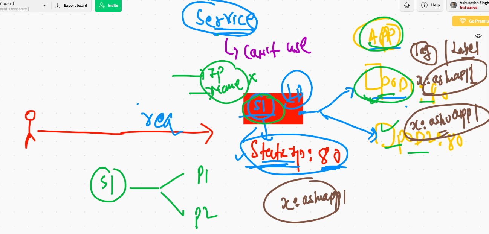
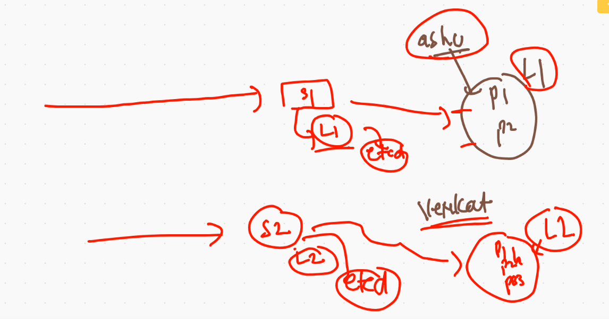
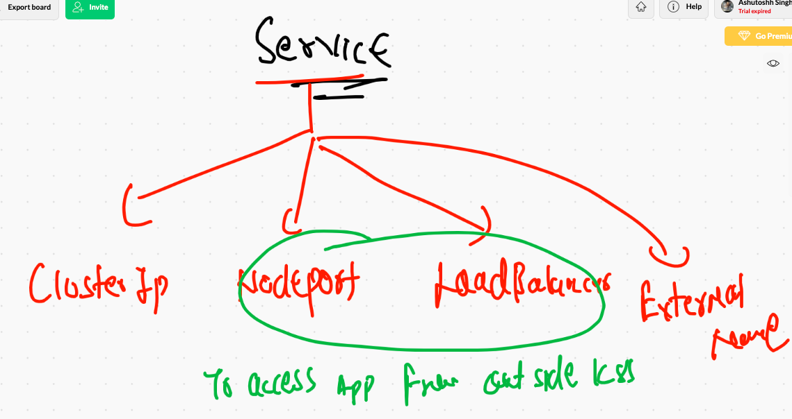
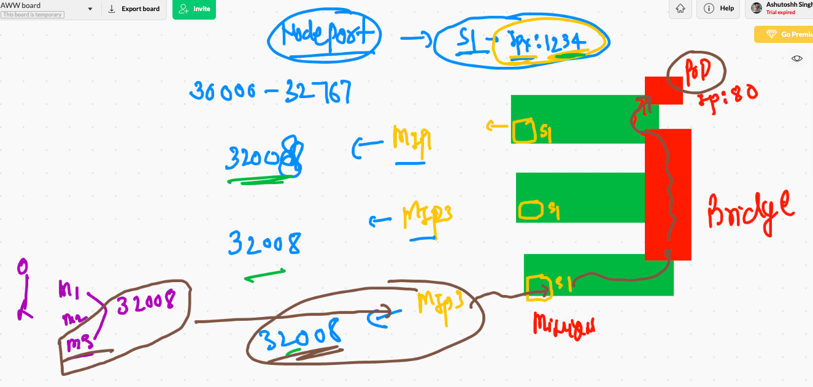
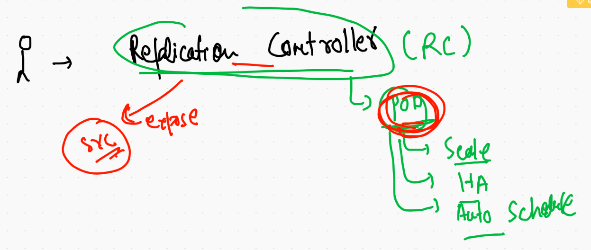

# K8s Revision 

## Minikube commands

```
❯ minikube status
minikube
type: Control Plane
host: Running
kubelet: Running
apiserver: Running
kubeconfig: Configured
timeToStop: Nonexistent

❯ minikube stop
✋  Stopping node "minikube"  ...
🛑  Powering off "minikube" via SSH ...
🛑  1 nodes stopped.
❯ minikube status
minikube
type: Control Plane
host: Stopped
kubelet: Stopped
apiserver: Stopped
kubeconfig: Stopped
timeToStop: Nonexistent

❯ minikube start
😄  minikube v1.17.1 on Darwin 11.2.1
✨  Using the docker driver based on existing profile
👍  Starting control plane node minikube in cluster minikube
🔄  Restarting existing docker container for "minikube" ...

```

## to COnnect remote cluster you can set evn in current terminal 

### FOR mac / LInux 

```
8095  kubectl  get  nodes  --kubeconfig  Desktop/admin.conf 
 8096  export KUBECONFIG=/Users/fire/Desktop/admin.conf
```

### For windows powershell


``` 
$env:KUBECONFIG="AbsPAth"

```


# POds 

```
❯ kubectl  get  pods
NAME          READY   STATUS             RESTARTS   AGE
ashishpod1    1/1     Running            1          16h
ashupod-1     1/1     Running            1          17h
hinapod1-1    1/1     Running            1          16h
nag-1         1/1     Running            1          17h
punyapod1     0/1     CrashLoopBackOff   15         17h
punyapod21    0/1     CrashLoopBackOff   12         16h
rajipod-1     1/1     Running            1          17h
sukupod-1     1/1     Running            1          16h
testpod-v1    1/1     Running            1          17h
vpasampod-1   1/1     Running            1          16h
❯ kubectl  get  pods  -o wide
NAME          READY   STATUS             RESTARTS   AGE   IP               NODE          NOMINATED NODE   READINESS GATES
ashishpod1    1/1     Running            1          16h   192.168.54.76    k8s-minion1   <none>           <none>
ashupod-1     1/1     Running            1          17h   192.168.54.85    k8s-minion1   <none>           <none>
hinapod1-1    1/1     Running            1          16h   192.168.27.253   k8s-minion2   <none>           <none>
nag-1         1/1     Running            1          17h   192.168.54.81    k8s-minion1   <none>           <none>
punyapod1     0/1     CrashLoopBackOff   15         17h   192.168.54.89    k8s-minion1   <none>           <none>
punyapod21    0/1     CrashLoopBackOff   12         16h   192.168.54.90    k8s-minion1   <none>           <none>
rajipod-1     1/1     Running            1          17h   192.168.27.251   k8s-minion2   <none>           <none>
sukupod-1     1/1     Running            1          16h   192.168.27.243   k8s-minion2   <none>           <none>
testpod-v1    1/1     Running            1          17h   192.168.27.248   k8s-minion2   <none>           <none>
vpasampod-1   1/1     Running            1          16h   192.168.27.254   k8s-minion2   <none>           <none>

```

## Pod delete 

```
 kubectl delete pods  ashupod-1
```

===

```
❯ kubectl delete pods --all
pod "ashishpod1" deleted
pod "hinapod1-1" deleted
pod "nag-1" deleted
pod "punyapod1" deleted
pod "punyapod21" deleted
pod "sukupod-1" deleted
pod "testpod-v1" deleted


```

## Pod auto generate 

```
❯ kubectl  run  ashupod2  --image=dockerashu/ashuhttpd:febv1  --port=80  --dry-run=client -o yaml
apiVersion: v1
kind: Pod
metadata:
  creationTimestamp: null
  labels:
    run: ashupod2
  name: ashupod2
spec:
  containers:
  - image: dockerashu/ashuhttpd:febv1
    name: ashupod2
    ports:
    - containerPort: 80
    resources: {}
  dnsPolicy: ClusterFirst
  restartPolicy: Always
status: {}

```

## pod in JSON format 

```
❯ kubectl  run  ashupod2  --image=dockerashu/ashuhttpd:febv1  --port=80  --dry-run=client -o json
{
    "kind": "Pod",
    "apiVersion": "v1",
    "metadata": {
        "name": "ashupod2",
        "creationTimestamp": null,
        "labels": {
            "run": "ashupod2"
        }
    },
    "spec": {
        "containers": [
            {
                "name": "ashupod2",
                "image": "dockerashu/ashuhttpd:febv1",
                "ports": [
                    {
                        "containerPort": 80
                    }
                ],
                "resources": {}
            }
        ],
        "restartPolicy": "Always",
        "dnsPolicy": "ClusterFirst"
    },
    "status": {}
}

```

## saving file using dry-run 

```
 kubectl  run  ashupod2  --image=dockerashu/ashuhttpd:febv1  --port=80  --dry-run=client -o yaml   >ashupod2.yaml
❯ kubectl  run  ashupod2  --image=dockerashu/ashuhttpd:febv1  --port=80  --dry-run=client -o json  >ashupod3.json
❯ ls
ashupod1.yaml ashupod2.yaml ashupod3.json

```

## Deploying pod 

```
❯ ls
ashupod1.yaml ashupod2.yaml ashupod3.json
❯ kubectl  apply -f  ashupod2.yaml
pod/ashupod2 created
❯ kubectl  get  pods
NAME       READY   STATUS              RESTARTS   AGE
ashupod2   0/1     ContainerCreating   0          6s
nag-1      1/1     Running             0          15m
❯ kubectl  get  pods
NAME       READY   STATUS    RESTARTS   AGE
ashupod2   1/1     Running   0          13s
nag-1      1/1     Running   0          15m
❯ kubectl  get  pods  -o wide
NAME       READY   STATUS    RESTARTS   AGE   IP               NODE          NOMINATED NODE   READINESS GATES
ashupod2   1/1     Running   0          19s   192.168.27.252   k8s-minion2   <none>           <none>
nag-1      1/1     Running   0          15m   192.168.54.110   k8s-minion1   <none>           <none>


```

## from k8s client machine access application 

```
❯ kubectl  port-forward  ashupod2   1199:80
Forwarding from 127.0.0.1:1199 -> 80
Forwarding from [::1]:1199 -> 80
Handling connection for 1199
Handling connection for 1199

```

## Pod with Custom parent process

```
apiVersion: v1 # apiserver version for Pod creation
kind: Pod  # request to handle POd 
metadata:  # info about POd 
 name: ashupod-1 # name of POD 
spec: # info about app like container  / storage / security etc..
 containers:
 - image: alpine  # image from Docker hub 
   name: ashuc1 # name of container 
   command: ["/bin/sh","-c","ping 127.0.0.1"] # custom parent process
   
 ```
 
 ## some basic things 
 
 ```
  8173  kubectl replace -f  ashupod1.yaml  --force
 8174  kubectl get  pod  ashupod-1
 8175  kubectl logs  ashupod-1 
 8176  kubectl logs  -f ]ashupod-1 
 8177  kubectl logs  -f ashupod-1 
❯ kubectl exec -it  ashupod-1  --  sh
/ # 
/ # 
/ # cat  /etc/os-release 
NAME="Alpine Linux"
ID=alpine
VERSION_ID=3.13.2
PRETTY_NAME="Alpine Linux v3.13"
HOME_URL="https://alpinelinux.org/"
BUG_REPORT_URL="https://bugs.alpinelinux.org/"
/ # ifconfig 
eth0      Link encap:Ethernet  HWaddr B6:E2:34:8D:7D:16  
          inet addr:192.168.54.105  Bcast:192.168.54.105  Mask:255.255.255.255
          UP BROADCAST RUNNING MULTICAST  MTU:8981  Metric:1
          RX packets:5 errors:0 dropped:0 overruns:0 frame:0
          TX packets:0 errors:0 dropped:0 overruns:0 carrier:0
          collisions:0 txqueuelen:0 
          RX bytes:446 (446.0 B)  TX bytes:0 (0.0 B)

lo        Link encap:Local Loopback  
          inet addr:127.0.0.1  Mask:255.0.0.0
          UP LOOPBACK RUNNING  MTU:65536  Metric:1
          RX packets:192 errors:0 dropped:0 overruns:0 frame:0
          TX packets:192 errors:0 dropped:0 overruns:0 carrier:0
          collisions:0 txqueuelen:1000 
          RX bytes:16128 (15.7 KiB)  TX bytes:16128 (15.7 KiB)

/ # exit

░▒▓ ~/Desktop/ashupods ··········

```

# Service for static endpoint 

## service with label concept 



----




## Sservice. type. in k8s 



## NodePOrt service understanding 



### Note: before creating service check pod labels 

```
8185  kubectl  get   po  ashupod2 --show-labels
 8186  kubectl  get   po  --show-labels
❯ kubectl  get   po  ashupod2 --show-labels
NAME       READY   STATUS    RESTARTS   AGE   LABELS
ashupod2   1/1     Running   0          93m   run=ashupod2

```

## creating nodeport service 

```
 kubectl create  service  nodeport  ashusvc1  --tcp  1234:80  --dry-run=client -o yaml   >ashuservice1.yaml
 
```

## deploying service nodeport type 

```
❯ ls
ashupod1.yaml      ashupod2.yaml      ashupod3.json      ashuservice1.yaml  sunilpod-aws1.yaml
❯ kubectl  apply -f  ashuservice1.yaml
service/ashusvc1 created
❯ 
❯ kubectl get  service
NAME         TYPE        CLUSTER-IP       EXTERNAL-IP   PORT(S)          AGE
ashusvc1     NodePort    10.107.143.212   <none>        1234:32245/TCP   8s
kubernetes   ClusterIP   10.96.0.1        <none>        443/TCP          19h

```


## Deleting services

```
❯ kubectl  delete  svc  ashusvc1
service "ashusvc1" deleted
❯ kubectl  delete  svc  --all
service "anauvc1" deleted
service "ashishsvc1" deleted
service "hinasvc1" deleted
service "jeeservice1" deleted
service "kubernetes" deleted
service "nagsvc1" deleted
service "rajisvc1" deleted
service "saisvc1" deleted
service "spamarthic1" deleted

```

## another way to create servcie with automatic pod label matched

```
❯ kubectl  get  po  ashupod2
NAME       READY   STATUS    RESTARTS   AGE
ashupod2   1/1     Running   0          130m
❯ kubectl  get  po  ashupod2   --show-labels
NAME       READY   STATUS    RESTARTS   AGE    LABELS
ashupod2   1/1     Running   0          130m   run=ashupod2
❯ 
❯ kubectl  expose  pod   ashupod2  --type NodePort --port 1234 --target-port 80 --name ashusvc222
service/ashusvc222 exposed
❯ kubectl get  svc  -o wide
NAME         TYPE        CLUSTER-IP      EXTERNAL-IP   PORT(S)          AGE    SELECTOR
ashusvc222   NodePort    10.110.69.130   <none>        1234:32682/TCP   33s    run=ashupod2

```

# Replication controller 



## clean up 

```
 kubectl delete  all --all
 
 ```
 
 # RC
 
 ## Example 1
 
 ```
 apiVersion: v1
kind: ReplicationController
metadata:
 name: ashu-rc111
spec:
 replicas: 1  # no of pods 
 template: # it will use old yaml data 
  metadata:
   labels:
    x: hellome
  spec:
   containers:
   - image: dockerashu/ashuhttpd:febv1
     name: ashuc44
     ports:
     - containerPort: 80

```

