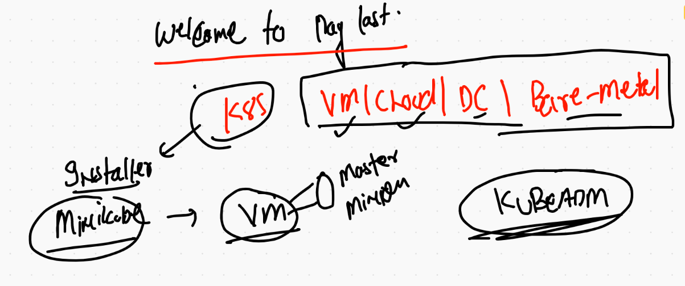
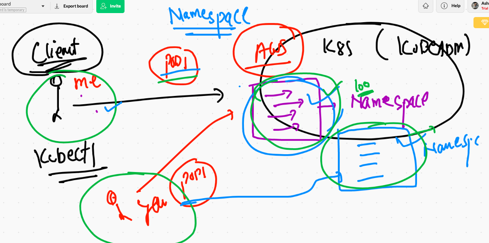
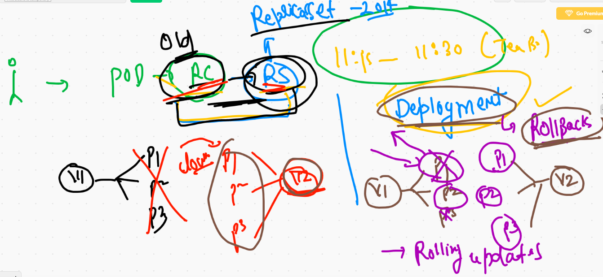
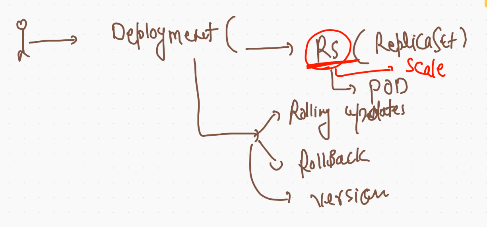
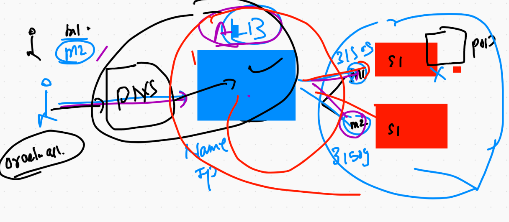

# K8s cluster deployment 



## Manualy deploy k8s cluster using KUBEADM ---

## steps to perform in all the systems 

```
[root@k8smaster ~]# cat setup.sh 
swapoff -a
modprobe br_netfilter
echo '1' > /proc/sys/net/bridge/bridge-nf-call-iptables

yum  install  docker -y
systemctl  enable --now docker  

## install kubeadm 

cat  <<EOF  >/etc/yum.repos.d/kube.repo
[kube]
baseurl=https://packages.cloud.google.com/yum/repos/kubernetes-el7-x86_64
gpgcheck=0
EOF


yum  install kubeadm  kubelet  -y

systemctl enable --now kubelet  

```

## ONly on Master Node 

```
[root@k8smaster ~]# kubeadm  init  --pod-network-cidr=192.168.0.0/16  --apiserver-advertise-address=0.0.0.0  --apiserver-cert-extra-sans=34.231.73.107   
[init] Using Kubernetes version: v1.20.4
[preflight] Running pre-flight checks
	[WARNING IsDockerSystemdCheck]: detected "cgroupfs" as the Docker cgroup driver. The recommended driver is "systemd". Please follow the guide at https://kubernetes.io/docs/setup/cri/
	[WARNING FileExisting-tc]: tc not found in system path
	[WARNING Hostname]: hostname "k8smaster" could not be reached
	[WARNING Hostname]: hostname "k8smaster": lookup k8smaster on 172.31.0.2:53: no such host
[preflight] Pulling images required for setting up a Kubernetes cluster
[preflight] This might take a minute or two, depending on the speed of your internet connection
[preflight] You can also perform this action in beforehand using 'kubeadm config images pull'


```

--- After some time you will see output like this 

```
strap Token
[bootstrap-token] configured RBAC rules to allow certificate rotation for all node client certificates in the cluster
[bootstrap-token] Creating the "cluster-info" ConfigMap in the "kube-public" namespace
[kubelet-finalize] Updating "/etc/kubernetes/kubelet.conf" to point to a rotatable kubelet client certificate and key
[addons] Applied essential addon: CoreDNS
[addons] Applied essential addon: kube-proxy

Your Kubernetes control-plane has initialized successfully!

To start using your cluster, you need to run the following as a regular user:

  mkdir -p $HOME/.kube
  sudo cp -i /etc/kubernetes/admin.conf $HOME/.kube/config
  sudo chown $(id -u):$(id -g) $HOME/.kube/config

Alternatively, if you are the root user, you can run:

  export KUBECONFIG=/etc/kubernetes/admin.conf

You should now deploy a pod network to the cluster.
Run "kubectl apply -f [podnetwork].yaml" with one of the options listed at:
  https://kubernetes.io/docs/concepts/cluster-administration/addons/

Then you can join any number of worker nodes by running the following on each as root:

kubeadm join 172.31.93.53:6443 --token pcknrp.f5mpy9y3w5s8h2uk \
    --discovery-token-ca-cert-hash sha256:0de16e91d0f5b0d5990c88d32e839203bef690241e6235ddbed4bfb32c38136e 
    
 ```
 
 ## Now check nodes from control plane
 
 ```
 
 [root@k8smaster ~]# kubectl  get  nodes
The connection to the server localhost:8080 was refused - did you specify the right host or port?
[root@k8smaster ~]# 
[root@k8smaster ~]# 
[root@k8smaster ~]# 
[root@k8smaster ~]# cd  /etc/kubernetes/
[root@k8smaster kubernetes]# ls
admin.conf  controller-manager.conf  kubelet.conf  manifests  pki  scheduler.conf
[root@k8smaster kubernetes]# 
[root@k8smaster kubernetes]# kubectl  get  nodes  --kubeconfig  admin.conf 
NAME        STATUS     ROLES                  AGE     VERSION
k8smaster   NotReady   control-plane,master   2m24s   v1.20.4
minion1     NotReady   <none>                 68s     v1.20.4
minion2     NotReady   <none>                 61s     v1.20.4

```

## Deploy calico as pod on Master node

```
 13  wget https://docs.projectcalico.org/manifests/calico.yaml
   14  ls
   15  kubectl apply -f  calico.yaml   --kubeconfig admin.conf 
```


## From client system we can connect like 

### Method 1 

```
❯ kubectl  get  nodes  --kubeconfig  admin.conf
NAME        STATUS   ROLES                  AGE     VERSION
k8smaster   Ready    control-plane,master   9m20s   v1.20.4
minion1     Ready    <none>                 8m4s    v1.20.4
minion2     Ready    <none>                 7m57s   v1.20.4

```


### Method 2 

```
❯ export KUBECONFIG=/Users/fire/Desktop/admin.conf
❯ 
❯ kubectl  get  nodes
NAME        STATUS   ROLES                  AGE     VERSION
k8smaster   Ready    control-plane,master   11m     v1.20.4
minion1     Ready    <none>                 10m     v1.20.4
minion2     Ready    <none>                 9m54s   v1.20.4

==== FOr windows powershell only 

$env:KUBECONFIG="pathofadmin.conf"

```

### Method 3

```
 pwd
/Users/fire/.kube
❯ ls
cache                  config                 http-cache             kubectl_autocompletion storage

❯ cp -v  ~/Desktop/admin.conf  config
/Users/fire/Desktop/admin.conf -> config
❯ ls
cache                  http-cache             myminikubeconfig
config                 kubectl_autocompletion storage

```

## Namespace 



## checking default namespaces in k8s

```
❯ kubectl  get   namespace
NAME              STATUS   AGE
default           Active   24m
kube-node-lease   Active   24m
kube-public       Active   24m
kube-system       Active   24m

```

## more 

```
❯ kubectl  get   ns
NAME              STATUS   AGE
default           Active   24m
kube-node-lease   Active   24m
kube-public       Active   24m
kube-system       Active   24m
❯ kubectl  get  pods
No resources found in default namespace.


```


### kube-system namespace 

```
❯ kubectl  get  pods   -n  kube-system
NAME                                       READY   STATUS    RESTARTS   AGE
calico-kube-controllers-66956989f4-gvkjk   1/1     Running   0          22m
calico-node-mrppq                          1/1     Running   0          22m
calico-node-qskk9                          1/1     Running   0          22m
calico-node-qzpng                          1/1     Running   0          22m
coredns-74ff55c5b-h9phl                    1/1     Running   0          26m
coredns-74ff55c5b-rpwj2                    1/1     Running   0          26m
etcd-k8smaster                             1/1     Running   0          26m
kube-apiserver-k8smaster                   1/1     Running   0          26m
kube-controller-manager-k8smaster          1/1     Running   0          26m
kube-proxy-5qhrd                           1/1     Running   0          25m
kube-proxy-99wcd                           1/1     Running   0          25m
kube-proxy-cfpqd                           1/1     Running   0          26m
kube-scheduler-k8smaster                   1/1     Running   0          26m

```

## creating custom namespace

```
❯ kubectl  create  namespace  ashu-space
namespace/ashu-space created
❯ kubectl  get   ns
NAME              STATUS   AGE
ashu-space        Active   4s
default           Active   30m
kube-node-lease   Active   30m
kube-public       Active   30m
kube-system       Active   30m

```

## changing default namespace 

```
 kubectl  config set-context  --current  --namespace=ashu-space
Context "kubernetes-admin@kubernetes" modified.


```

## checking default namespace 

```
❯ kubectl  config get-contexts
CURRENT   NAME                          CLUSTER      AUTHINFO           NAMESPACE
*         kubernetes-admin@kubernetes   kubernetes   kubernetes-admin   ashu-space

```


## TOmcat dockerfile with JSP webapp

```
FROM tomcat
# standard tomcat image from Docker hub
MAINTAINER ashutoshh@linux.com
WORKDIR  /usr/local/tomcat/webapps
RUN mkdir ashuapp
WORKDIR ashuapp
COPY myapp  .
RUN chmod 755 . -R
# is optional to fix permission issues in JAVA backend file
EXPOSE 8080

# Note :- Here i am not gonna use CMD /Entrypoint 
# so FROM image parent process will be inherited 

```

## BUilding images

```
 ls
Dockerfile README.md  myapp
❯ docker  build  -t   dockerashu/oraclejsp:v0001  .
Sending build context to Docker daemon  102.9kB
Step 1/8 : FROM tomcat
 ---> bf4709e77b18
Step 2/8 : MAINTAINER ashutoshh@linux.com
 ---> Running in e3c13425cb92
Removing intermediate container e3c13425cb92
 ---> 97b05a2d2663
Step 3/8 : WORKDIR  /usr/local/tomcat/webapps
 ---> Running in b60394196d17
Removing intermediate container b60394196d17
 ---> eef6faf40c2c
Step 4/8 : RUN mkdir ashuapp
 ---> Running in 1e6c05156240
Removing intermediate container 1e6c05156240
 ---> 099c1094f899
Step 5/8 : WORKDIR ashuapp
 ---> Running in 25da672c9e23
Removing intermediate container 25da672c9e23
 ---> 858c19b2ad75
Step 6/8 : COPY myapp  .
 ---> f9a5b3c539b8
Step 7/8 : RUN chmod 755 . -R
 ---> Running in e6b52e54c61c
Removing intermediate container e6b52e54c61c
 ---> 5157fa38e655
Step 8/8 : EXPOSE 8080
 ---> Running in f561e28e7b7c
Removing intermediate container f561e28e7b7c
 ---> 5120d67d6607
Successfully built 5120d67d6607
Successfully tagged dockerashu/oraclejsp:v0001

```
# Deployment in k8s



## More about deployment 



## Deployment yaml 

```
kubectl  create  deployment  ashujavawebapp1  --image=dockerashu/oraclejsp:v0001  --dry-run=client -o yaml >ashudep1.yaml

```

### deploying 

```
❯ kubectl  config get-contexts
CURRENT   NAME                          CLUSTER      AUTHINFO           NAMESPACE
*         kubernetes-admin@kubernetes   kubernetes   kubernetes-admin   ashu-space
❯ kubectl apply -f  ashudep1.yaml
deployment.apps/ashujavawebapp1 created
❯ kubectl  get  deployments
NAME              READY   UP-TO-DATE   AVAILABLE   AGE
ashujavawebapp1   0/1     1            0           13s
❯ kubectl  get  deployment
NAME              READY   UP-TO-DATE   AVAILABLE   AGE
ashujavawebapp1   1/1     1            1           18s
❯ 
❯ 
❯ kubectl  get  deploy
NAME              READY   UP-TO-DATE   AVAILABLE   AGE
ashujavawebapp1   1/1     1            1           22s


```

## Exposing deployment to create service 

```
❯ kubectl  get  deploy
NAME              READY   UP-TO-DATE   AVAILABLE   AGE
ashujavawebapp1   1/1     1            1           2m50s
❯ kubectl   get   rs
NAME                        DESIRED   CURRENT   READY   AGE
ashujavawebapp1-f8f7cbf77   1         1         1       2m58s
❯ 
❯ kubectl   get   po
NAME                              READY   STATUS    RESTARTS   AGE
ashujavawebapp1-f8f7cbf77-wd7k7   1/1     Running   0          3m4s
❯ 
❯ kubectl   expose deployment  ashujavawebapp1  --type NodePort  --port 8080  --name ashusvc1
service/ashusvc1 exposed
❯ kubectl  get  svc
NAME       TYPE       CLUSTER-IP       EXTERNAL-IP   PORT(S)          AGE
ashusvc1   NodePort   10.108.122.242   <none>        8080:31708/TCP   6s


```

## LOadbalancer service

```
❯ kubectl get deploy
NAME              READY   UP-TO-DATE   AVAILABLE   AGE
ashujavawebapp1   1/1     1            1           43m
dd                1/1     1            1           12m
❯ kubectl  expose deployment  dd  --type LoadBalancer  --port 80 --name oklb
service/oklb exposed
❯ kubectl  get  svc
NAME       TYPE           CLUSTER-IP       EXTERNAL-IP   PORT(S)          AGE
ashusvc1   NodePort       10.108.122.242   <none>        8080:31708/TCP   40m
dd         NodePort       10.104.157.6     <none>        80:30276/TCP     12m
oklb       LoadBalancer   10.101.99.2      <pending>     80:31305/TCP     5s
❯ kubectl  expose deployment  ashujavawebapp1  --type LoadBalancer  --port 8080 --name oklb1
service/oklb1 exposed
❯ kubectl  get  svc
NAME       TYPE           CLUSTER-IP       EXTERNAL-IP   PORT(S)          AGE
ashusvc1   NodePort       10.108.122.242   <none>        8080:31708/TCP   40m
dd         NodePort       10.104.157.6     <none>        80:30276/TCP     13m
oklb       LoadBalancer   10.101.99.2      <pending>     80:31305/TCP     55s
oklb1      LoadBalancer   10.106.130.179   <pending>     8080:32201/TCP   2s


```


## application in k8s with External Loadbalancer and External DNS 



```
 kubectl  scale  deployment  ashujavawebapp1  --replicas=3
```

## auto scale 

```
 kubectl autoscale deployment ashujavawebapp1 --min=2  --max=15 --cpu-percent=80
 
```

## history of deployment with docker build 

```
8477  kubectl  create  deployment  ashujavawebapp1  --image=dockerashu/oraclejsp:v0001  --dry-run=client -o yaml >ashudep1.yaml
 8478  history
 8479  ls
 8480  kubectl  config get-contexts 
 8481  kubectl apply -f  ashudep1.yaml 
 8482  kubectl  get  deployments 
 8483  kubectl  get  deployment
 8484  kubectl  get  deploy
 8485  kubectl   get   rs
 8486  kubectl   get   po
 8487  kubectl   expose deployment  ashujavawebapp1  --type NodePort  --port 8080  --name ashusvc1 
 8488  kubectl  get  svc
 8489  history
 8490  kubectl  get  svc
 8491  kubectl  get  po
 8492  kubectl exec -it  ashujavawebapp1-f8f7cbf77-wd7k7  -- bash
 8493  history
 8494  kubectl  get  svc
 8495  kubectl create deployment  --image=nginx 
 8496  kubectl create deployment  dd  --image=nginx 
 8497  kubectl  get  deploy
 8498  kubectl expose deployment dd  --type NodePort  --port 80 
 8499  kubectl get  svc
 8500  kubectl get deploy 
 8501  kubectl  expose deployment  dd  --type LoadBalancer  --port 80 --name oklb
 8502  kubectl  get  svc
 8503  kubectl  expose deployment  ashujavawebapp1  --type LoadBalancer  --port 8080 --name oklb1
 8504  kubectl  get  svc
 8505  kubectl  get deploy 
 8506  kubectl delete deploy dd  
 8507  kubectl  scale  deployment  ashujavawebapp1  --replicas=3
 8508  kubectl delete deploy dd  
 8509  kubectl  get deploy 
 8510  kubectl  get po
 8511  history
 8512  kubectl  get po
 8513  kubectl  autoscale
 8514  kubectl  autoscale  --help
 8515  history
 8516  kubectl autoscale deployment ashujavawebapp1 --min=2  --max=15 --cpu-percent=80
 8517  kubectl get  po
 8518  history
 8519  ls
 8520  cd  javawebapp
 8521  ls
 8522  cd  myapp
 8523  ls
 8524  vim index.html
 8525  ls
 8526  vim index.html
 8527  cat index.html
 8528  history
 8529  docker  build  -t   dockerashu/oraclejsp:v0002  . 
 8530  cd ..
 8531  docker  build  -t   dockerashu/oraclejsp:v0002  . 
 8532  docker push   dockerashu/oraclejsp:v0002  
 8533  history
 8534  kubectl  get  deployment 
 8535  kubectl  describe   deployment ashujavawebapp1 
 8536  kubectl  set  image  deployment  ashujavawebapp1  oraclejsp=dockerashu/oraclejsp:v0002
 8537  history
 8538  kubectl  describe   deployment ashujavawebapp1
 
 ```
 
 


