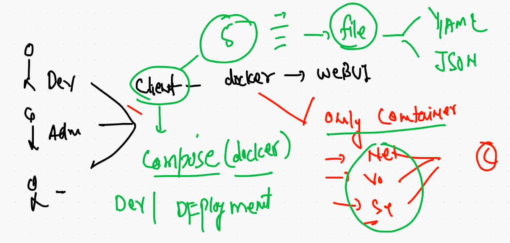
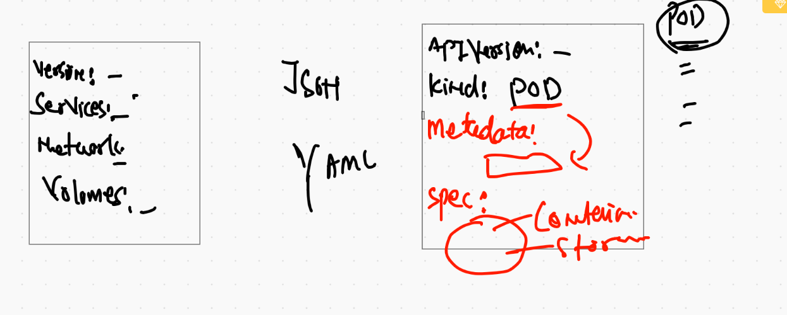

# Docker recap 

## cgroups 

```
7907  docker run -d --name x2  --memory 100m --cpus=1  alpine  ping 127.0.0.1
 7908  docker  stats
 7909  history
 7910  docker  ps
 7911  docker  update  x1  --memory 200m 
 7912  docker  update  x1  --help
 7913  docker  update  x1 --memory-swap 100m
 
 ```
 
 ## Docker build from Github 
 
 ```
 7922  docker  build  -t  ashuclang:v1  https://github.com/redashu/cLang.git 
 7923  docker  build  -t  ashuclang:v1  https://github.com/redashu/cLang.git\#main  
 7924  history
 7925  docker  build  -t  ashuclang:v1  https://github.com/redashu/cLang.git\#main  
 7926  docker  ps
 7927  docker images
 7928  docker run -itd --name x4  ashuclang:v1  
 7929  docker  logs -f  x4
 7930  history
 7931  docker rm $(docker ps -aq) -f
 7932  docker images

 7933  docker  rmi   657a59b5de45  e00462997c8c  778a5d68ef1b -f
 
 ```
 
 ## Docker volume 
 
 ```
 ❯ docker  volume  ls
DRIVER    VOLUME NAME
local     44e8bbdc11e43781623ee69b4d323b968538cb1fc4a679969cd2bb5f4df0f4f3
local     ashuvol123
local     htmlwebapps_ashudbdata
local     mycompose_ashudbvol1
❯ docker  volume  prune
WARNING! This will remove all local volumes not used by at least one container.
Are you sure you want to continue? [y/N] y
Total reclaimed space: 0B
❯ docker  volume  ls
DRIVER    VOLUME NAME

```


## Docker volume will be using Host space where docker engine is running 

```
❯ docker  volume  create  vol1
vol1
❯ docker  volume  ls
DRIVER    VOLUME NAME
local     vol1
❯ docker  volume  inspect  vol1
[
    {
        "CreatedAt": "2021-02-17T04:41:28Z",
        "Driver": "local",
        "Labels": {},
        "Mountpoint": "/var/lib/docker/volumes/vol1/_data",
        "Name": "vol1",
        "Options": {},
        "Scope": "local"
    }
]
❯ docker  info  |   grep -i root
 Docker Root Dir: /var/lib/docker
❯ docker  volume  create  vol2
vol2
❯ docker  volume  inspect  vol2
[
    {
        "CreatedAt": "2021-02-17T04:42:08Z",
        "Driver": "local",
        "Labels": {},
        "Mountpoint": "/var/lib/docker/volumes/vol2/_data",
        "Name": "vol2",
        "Options": {},
        "Scope": "local"
    }
]

```

## mounting a specific directory 

```
❯ docker  run  -it  --name check1  -v  /etc:/myhostetc:ro  alpine  sh
/ # ls
bin        etc        lib        mnt        opt        root       sbin       sys        usr
dev        home       media      myhostetc  proc       run        srv        tmp        var
/ # cd  myhostetc/
/myhostetc # ls
afpovertcp.cfg                         localtime                              postfix
aliases                                locate.rc                              ppp
aliases.db                             mail.rc                                profile
apache2                                m

```


## sharing file as volume 

```
❯ docker  run  -it  --name check1  -v  /etc/passwd:/aa.txt:ro  alpine  sh
/ # 
/ # ls
aa.txt  dev     home    media   opt     root    sbin    sys     usr
bin     etc     lib     mnt     proc    run     srv     tmp     var
/ # cat  aa.txt 
##
# User Database
# 
# Note that this file is consulted directly only when the system is running
# in single-user mode.  At other times this information is provided by
# Open Directory.
#
# See the opendirectoryd(8) man page for additional information about
# Open Directory.


```

## Docker volume more options 


## volume 

```
docker  run  -it  --name check2  -v  /etc/passwd:/aa.txt:ro -v  vol2:/mnt/go:rw     alpine  sh

```
# webui using volume as docker socket 


## running portianer 

```
❯ docker  run  -d --name  webui  -v  /var/run/docker.sock:/var/run/docker.sock  -p 1122:9000  portainer/portainer
Unable to find image 'portainer/portainer:latest' locally
latest: Pulling from portainer/portainer
d1e017099d17: Pull complete 
717377b83d5c: Pull complete 
Digest: sha256:f8c2b0a9ca640edf508a8a0830cf1963a1e0d2fd9936a64104b3f658e120b868
Status: Downloaded newer image for portainer/portainer:latest
0529bef1d64026b9f119b185210102d785d09dec8aa8ff1204af95cee777dc56
❯ docker  ps
CONTAINER ID   IMAGE                 COMMAND        CREATED         STATUS         PORTS                    NAMES
0529bef1d640   portainer/portainer   "/portainer"   5 seconds ago   Up 3 seconds   0.0.0.0:1122->9000/tcp   webui


```


# WElcome to docker compose 



# Docker compose install 

[compose install](https://docs.docker.com/compose/install/)


## checking compose installation 

```
❯ docker-compose -v
docker-compose version 1.27.4, build 40524192


```

## compose file version 


## Compose example 1

```
version: '3.8' # most stable version of compose file
services: # to define your single or multiple application
 ashuapp1: # name of my app
  image: alpine
  container_name: ashucc1
  command: ping 127.0.0.1 

```

## compose commands 

```
7982  docker-compose up  -d 
 7983  docker-compose ps
 7984  docker-compose  stop
 7985  docker-compose ps
 7986  docker-compose -v
 7987  history
 7988  docker-compose ps
 7989  docker-compose start
 7990  docker-compose kill
 7991  docker-compose ps
 7992  docker-compose start
 7993  docker compose  ps
 7994  docker-compose ps
 7995  history
 7996  docker-compose
❯ docker-compose down
Stopping ashucc1 ... done
Removing ashucc1 ... done
Removing network example1_default

```

## sample example 

```
❯ ls
docker-compose.yaml
❯ docker-compose up -d
Creating network "example1_default" with the default driver
Creating ashucc1 ... done
❯ docker-compose ps
 Name        Command       State   Ports
----------------------------------------
ashucc1   ping 127.0.0.1   Up           
❯ docker-compose logs
Attaching to ashucc1
ashucc1     | PING 127.0.0.1 (127.0.0.1): 56 data bytes
ashucc1     | 64 bytes from 127.0.0.1: seq=0 ttl=64 time=0.111 ms
ashucc1     | 64 bytes from 127.0.0.1: seq=1 ttl=64 time=0.158 ms
ashucc1     | 64 bytes from 127.0.0.1: seq=2 ttl=64 time=0.171 ms
ashucc1     | 64 bytes from 127.0.0.1: seq=3 ttl=64 time=0.137 ms
ashucc1     | 64 bytes from 127.0.0.1: seq=4 ttl=64 time=0.119 ms
ashucc1     | 64 bytes from 127.0.0.1: seq=5 ttl=64 time=0.146 ms
ashucc1     | 64 bytes from 127.0.0.1: seq=6 ttl=64 time=0.149 ms
ashucc1     | 64 bytes from 127.0.0.1: seq=7 ttl=64 time=0.179 ms
❯ docker-compose logs -f
Attaching to ashucc1
ashucc1     | PING 127.0.0.1 (127.0.0.1): 56 data bytes
ashucc1     | 64 bytes from 127.0.0.1: seq=0 ttl=64 time=0.111 ms
ashucc1     | 64 bytes from 127.0.0.1: seq=1 ttl=64 time=0.158 ms
ashucc1     | 64 bytes from 127.0.0.1: seq=2 ttl=64 time=0.171 ms
ashucc1     | 64 bytes from 127.0.0.1: seq=3 ttl=64 time=0.137 ms
ashucc1     | 64 bytes from 127.0.0.1: seq=4 tt

```

## compsoe example 2

```
version: '3.8' # most stable version of compose file
services: # to define your single or multiple application
 ashuapp1: # name of my app
  image: alpine
  container_name: ashucc1
  command: ping 127.0.0.1 

 ashuapp2: # app 2 
  image: dockerashu/ashuhttpd:febv1 
  container_name: ashucc22
  ports:
   - "2244:80"
 

# docker  run  -d --name ashucc22 -p 2244:80 dockerashu/ashuhttpd:febv1

```

## Example 3

```
version: '3.8'
services:
  ashubuildrun1: 
    image: mywebapp:v1 # image that i wanna build
    build: . # location of Dockerfile 
    container_name: ashuxc44 
    ports:
      - "9988:80"

# note :- compose -- Build & run in case of Docker thing 

```

## running compose 

```
❯ ls
example1   htmlwebapp javaLang   pythonLang
❯ ls  htmlwebapp
CODE_OF_CONDUCT.md LICENSE            ashucompose.yaml   index.html
Dockerfile         README.md          images             styles
❯ cd htmlwebapp
❯ ls
CODE_OF_CONDUCT.md LICENSE            ashucompose.yaml   index.html
Dockerfile         README.md          images             styles
❯ docker-compose up -d
ERROR: 
        Can't find a suitable configuration file in this directory or any
        parent. Are you in the right directory?

        Supported filenames: docker-compose.yml, docker-compose.yaml
        
❯ docker-compose -f  ashucompose.yaml  up  -d
Creating network "htmlwebapp_default" with the default driver
Building ashubuildrun1
Step 1/8 : FROM oraclelinux:8.3
 ---> d8ccb1b24024
Step 2/8 : MAINTAINER ashutoshh@linux.com
 ---> Running in 502b2064e4d7
Removing intermediate container 502b2064e4d7
 ---> dfe530967762
Step 3/8 : RUN dnf install httpd -y
 ---> Running in d6cc1cb8f573
Oracle Linux 8 BaseOS Latest (x86_64)           5.5 MB/s |  29 MB     00:05    
Oracle Linux 8 Application Stream (x86_64)      6.1 

```

## Docker engine based  app deployment problems


## container orchestraion tools / tech 


## Info k8s


## K8s more options 


# Kubernetes ---

## L1. arch 


## kube-apiserver. 


## kube-schedular. -- to FInd the best minion node for your application to deploy 


## Node controller - a controller for worker/ minion node


## Minion Node. CNI  


## Note : kube-proxy will be managing communication b/w or among the containers across minion node 


# Minikube based k8s cluster 


## MInikube installation on mac 

```
❯ brew install minikube


----

```

##  Deployment of cluster using minikube 

```
❯ minikube start --driver=docker
😄  minikube v1.17.1 on Darwin 11.2.1
✨  Using the docker driver based on user configuration
👍  Starting control plane node minikube in cluster minikube
🚜  Pulling base image ...
🔥  Creating docker container (CPUs=2, Memory=1990MB) ...
🐳  Preparing Kubernetes v1.20.2 on Docker 20.10.2 ...
    ▪ Generating certificates and keys ...
    ▪ Booting up control plane ...
    ▪ Configuring RBAC rules ...
🔎  Verifying Kubernetes components...
🌟  Enabled addons: storage-provisioner, default-storageclass
🏄  Done! kubectl is now configured to use "minikube" cluster and "default" namespace by default

```


## Install kubectl on Mac 

```
❯ curl -LO "https://dl.k8s.io/release/$(curl -L -s https://dl.k8s.io/release/stable.txt)/bin/darwin/amd64/kubectl"
  % Total    % Received % Xferd  Average Speed   Time    Time     Time  Current
                                 Dload  Upload   Total   Spent    Left  Speed
100   161  100   161    0     0    489      0 --:--:-- --:--:-- --:--:--   489
100 44.0M  100 44.0M    0     0  8390k      0  0:00:05  0:00:05 --:--:-- 9915k
❯ chmod +x ./kubectl
❯ sudo mv ./kubectl /usr/local/bin/kubectl
❯ kubectl   version  --client
Client Version: version.Info{Major:"1", Minor:"20", GitVersion:"v1.20.2", GitCommit:"faecb196815e248d3ecfb03c680a4507229c2a56", GitTreeState:"clean", BuildDate:"2021-01-13T13:28:09Z", GoVersion:"go1.15.5", Compiler:"gc", Platform:"darwin/amd64"}


```


## Kubectl to connect. k8s clusetre 

```
❯ kubectl version
Client Version: version.Info{Major:"1", Minor:"20", GitVersion:"v1.20.2", GitCommit:"faecb196815e248d3ecfb03c680a4507229c2a56", GitTreeState:"clean", BuildDate:"2021-01-13T13:28:09Z", GoVersion:"go1.15.5", Compiler:"gc", Platform:"darwin/amd64"}
Server Version: version.Info{Major:"1", Minor:"20", GitVersion:"v1.20.2", GitCommit:"faecb196815e248d3ecfb03c680a4507229c2a56", GitTreeState:"clean", BuildDate:"2021-01-13T13:20:00Z", GoVersion:"go1.15.5", Compiler:"gc", Platform:"linux/amd64"}
❯ kubectl  cluster-info
Kubernetes control plane is running at https://127.0.0.1:55000
KubeDNS is running at https://127.0.0.1:55000/api/v1/namespaces/kube-system/services/kube-dns:dns/proxy

To further debug and diagnose cluster problems, use 'kubectl cluster-info dump'.

```

## Kubectl to connect remote k8s cluster

```
❯ cd  Desktop
❯ ls
DevopsSRE         PHD               backup            mycode            oracle15thfeb2021 oraclepublic.pub
HelmDocs          admin.conf        minikube.png      or.token          oracleprivate.key techienest
❯
❯ kubectl  cluster-info
Kubernetes control plane is running at https://127.0.0.1:55000
KubeDNS is running at https://127.0.0.1:55000/api/v1/namespaces/kube-system/services/kube-dns:dns/proxy

To further debug and diagnose cluster problems, use 'kubectl cluster-info dump'.
❯
❯
❯ kubectl  cluster-info   --kubeconfig  admin.conf
Kubernetes control plane is running at https://34.198.161.17:6443
KubeDNS is running at https://34.198.161.17:6443/api/v1/namespaces/kube-system/services/kube-dns:dns/proxy

To further debug and diagnose cluster problems, use 'kubectl cluster-info dump'.
❯
❯ kubectl   get  nodes
NAME       STATUS   ROLES                  AGE   VERSION
minikube   Ready    control-plane,master   29m   v1.20.2
❯ kubectl   get  nodes  --kubeconfig  admin.conf
NAME          STATUS   ROLES                  AGE     VERSION
k8s-master    Ready    control-plane,master   5d17h   v1.20.2
k8s-minion1   Ready    <none>                 5d17h   v1.20.2
k8s-minion2   Ready    <none>                 5d17h   v1.20.2
k8s-minion3   Ready    <none>                 5d17h   v1.20.2

```


## More ways to connect

```
❯ kubectl  get   nodes   --kubeconfig  admin.conf
NAME          STATUS   ROLES                  AGE     VERSION
k8s-master    Ready    control-plane,master   5d17h   v1.20.2
k8s-minion1   Ready    <none>                 5d17h   v1.20.2
k8s-minion2   Ready    <none>                 5d17h   v1.20.2
k8s-minion3   Ready    <none>                 5d17h   v1.20.2
❯
❯ export  KUBECONFIG=./admin.conf
❯
❯ kubectl  get   nodes
NAME          STATUS   ROLES                  AGE     VERSION
k8s-master    Ready    control-plane,master   5d17h   v1.20.2
k8s-minion1   Ready    <none>                 5d17h   v1.20.2
k8s-minion2   Ready    <none>                 5d17h   v1.20.2
k8s-minion3   Ready    <none>                 5d17h   v1.20.2
❯

```

## Understanding kubernetes. POds 


## compose vs pod file comparasion 




## First pod 

```
apiVersion: v1 # apiserver version for Pod creation
kind: Pod  # request to handle POd 
metadata:  # info about POd 
 name: ashupod-1 # name of POD 
spec: # info about app like container  / storage / security etc..
 containers:
 - image: nginx  # image from Docker hub 
   name: ashuc1 # name of container 
   ports: # default application port 
   - containerPort: 80
```


## Deployment of PODs

```
❯  export  KUBECONFIG=/Users/fire/Desktop/admin.conf
❯
❯
❯ kubectl  apply  -f  ashupod1.yaml  --dry-run=client
pod/ashupod-1 created (dry run)
❯
❯ kubectl  apply  -f  ashupod1.yaml
pod/ashupod-1 created
❯ kubectl   get  pods
NAME        READY   STATUS    RESTARTS   AGE
ashupod-1   1/1     Running   0          31s
❯ kubectl   get  pods
NAME        READY   STATUS    RESTARTS   AGE
ashupod-1   1/1     Running   0          63s

░▒▓ ~/Desktop/ashupods ··············································· kubernetes-admin@kubernetes ⎈  04:59:32 PM ▓▒░─╮
❯ kubectl   get  pods                                                                                                   ─╯
❯ kubectl   get  pods
NAME         READY   STATUS             RESTARTS   AGE
ashishpod1   1/1     Running            0          117s
ashupod-1    1/1     Running            0          8m17s
nag-1        1/1     Running            0          4m55s
punyapod1    0/1     CrashLoopBackOff   5          5m16s
rajipod-1    1/1     Running            0          5m48s
sukupod-1    1/1     Running            0          3m
testpod-v1   1/1     Running            0          5m13s
❯ kubectl   get  po
NAME         READY   STATUS             RESTARTS   AGE
ashishpod1   1/1     Running            0          2m
ashupod-1    1/1     Running            0          8m20s
nag-1        1/1     Running            0          4m58s
punyapod1    0/1     CrashLoopBackOff   5          5m19s
rajipod-1    1/1     Running            0          5m51s
sukupod-1    1/1     Running            0          3m3s
testpod-v1   1/1     Running            0          5m16s
❯ kubectl  get no
NAME          STATUS   ROLES                  AGE     VERSION
k8s-master    Ready    control-plane,master   5d18h   v1.20.2
k8s-minion1   Ready    <none>                 5d18h   v1.20.2
k8s-minion2   Ready    <none>                 5d18h   v1.20.2
k8s-minion3   Ready    <none>                 5d18h   v1.20.2

░▒▓ ~/Desktop/ashupods ··············································· kubernetes-admin@kubernetes ⎈  05:07:10 PM ▓▒░─╮
❯ kubectl   get  pods                                                                                                   ─╯


❯ kubectl   get  pods  -o wide
NAME         READY   STATUS             RESTARTS   AGE     IP               NODE          NOMINATED NODE   READINESS GATES
ashishpod1   1/1     Running            0          2m29s   192.168.54.66    k8s-minion1   <none>           <none>
ashupod-1    1/1     Running            0          8m49s   192.168.54.69    k8s-minion1   <none>           <none>
nag-1        1/1     Running            0          5m27s   192.168.54.70    k8s-minion1   <none>           <none>
punyapod1    0/1     CrashLoopBackOff   5          5m48s   192.168.54.124   k8s-minion1   <none>           <none>
rajipod-1    1/1     Running            0          6m20s   192.168.27.218   k8s-minion2   <none>           <none>
sukupod-1    1/1     Running            0          3m32s   192.168.27.227   k8s-minion2   <none>           <none>
testpod-v1   1/1     Running            0          5m45s   192.168.27.215   k8s-minion2   <none>           <none>


```

